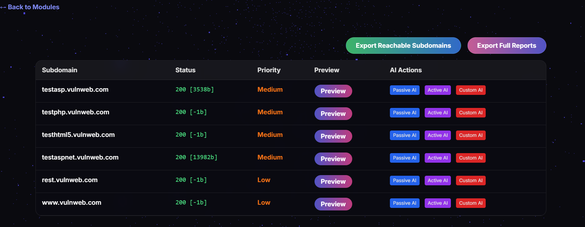

# VULN_AI

> *_🚧Project under active development_*
---
A AI Powered modern web based, All in One security Reseacher Toolkit for subdomain reconnaissance and attack surface discovery.

---



## 🚀 Features

- **Subdomain Analysis**
  - Fast, concurrent probing of subdomains (configurable RPS)
  - Deep crawl for endpoint discovery, Technology detection (Wappalyzer integration)
  - Port scanning (Top 100)
  - Human-readable, downloadable reports for each subdomain zip file
  - Real-time progress and results via WebSocket
  - Modern, responsive web UI (no build step required)
  - Support AI Passive and Custom Prompt.

---

## 🛠️ Installation & Usage

### Backend (Go)

1. **Install Go** (v1.20+ recommended)
2. **Setup and build:**
   ```sh
   cd backend
   go mod init vuln-ai-backend
   go mod tidy
   go run main.go
   ```
OR   
   ```
   cd backend
   go mod init vuln-ai-backend
   go mod tidy
   go build -o vuln-ai-backend
   
   #run command
   ./vuln-ai-backend
   ```

### Frontend

- Open `frontend/index.html` directly in your browser (no build or server needed).

---

## 📝 Workflow


---

## 📦 Modules

- **Subdomain Analysis:**  
  _Ready To Use!_
  

- **URL Analysis:**  
  _Add in Future!_

- **JS Analysis:**  
  _Add in Future!_
---

> _VULN_AI is under active development. Contributions and feedback are welcome!_ 
---
